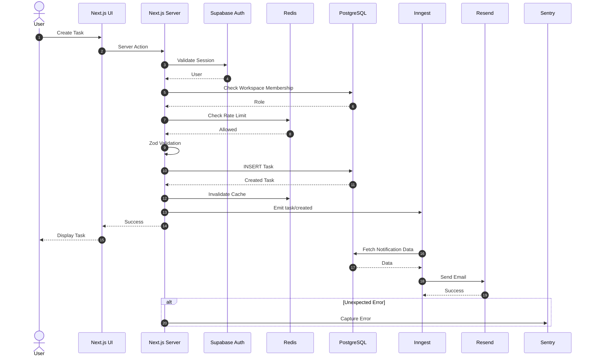

# TaskFlow — Phase-wise Implementation Guide 🚀

A practical implementation roadmap for building **TaskFlow**, a production-oriented project management SaaS.

The goal is to understand the complete full-stack lifecycle:

```text
Frontend
   ↓
Backend
   ↓
Authentication
   ↓
Authorization
   ↓
Validation
   ↓
Database
   ↓
Cache
   ↓
Background Jobs
   ↓
External Services
   ↓
Monitoring
   ↓
Deployment
```

---

# 🛠 Tech Stack

| Area | Technology |
|---|---|
| Framework | Next.js + TypeScript |
| UI | Tailwind CSS + shadcn/ui |
| Database | Supabase PostgreSQL |
| ORM | Drizzle ORM |
| Authentication | Supabase Auth |
| Validation | Zod |
| Cache | Upstash Redis |
| Rate Limiting | Upstash Redis |
| Email | Resend |
| Background Jobs | Inngest |
| File Storage | Supabase Storage |
| Monitoring | Sentry |
| Deployment | Vercel |

---

# Phase 0 — Planning & System Design

## Objective

Understand what we are building before writing code.

## Core Entities

```text
User
Workspace
Workspace Member
Project
Task
Comment
Attachment
Invitation
Activity Log
```

## Roles

```text
OWNER
ADMIN
MEMBER
```

## Main User Flow

```text
Signup
  ↓
Create Workspace
  ↓
Invite Members
  ↓
Create Project
  ↓
Create Tasks
  ↓
Assign Tasks
  ↓
Comments / Attachments
  ↓
Notifications
```

## Learn

- Requirement analysis
- Entity identification
- Database relationships
- Basic system design

## Completion Check

You should be able to explain the complete application flow before starting implementation.

---

# Phase 1 — Next.js Foundation

## Objective

Create the application foundation and understand the Next.js App Router.

## Create Project

```bash
npx create-next-app@latest taskflow
cd taskflow
```

Choose:

```text
TypeScript      Yes
ESLint          Yes
Tailwind CSS    Yes
App Router      Yes
```

## Install shadcn/ui

```bash
npx shadcn@latest init
```

Add components:

```bash
npx shadcn@latest add button input card dialog dropdown-menu avatar badge form
```

## Initial Routes

```text
/
├── login
├── signup
└── dashboard
```

## Build

- Navbar
- Sidebar
- Dashboard shell
- Loading UI
- Error UI
- 404 page

## Initial Structure

```text
app/
├── (auth)/
│   ├── login/
│   └── signup/
│
├── dashboard/
│
├── layout.tsx
├── loading.tsx
├── error.tsx
└── page.tsx

components/
├── ui/
├── navbar.tsx
└── sidebar.tsx
```

## Learn

- App Router
- Server Components
- Client Components
- Layouts
- Routing
- Dynamic routes
- Loading boundaries
- Error boundaries

## Completion Check

- App runs locally
- Navigation works
- Dashboard layout works
- Understand `"use client"`

---

# Phase 2 — PostgreSQL + Drizzle ORM

## Objective

Design the relational database.

Create a **Supabase project**.

Install Drizzle:

```bash
npm install drizzle-orm postgres
npm install -D drizzle-kit
```

## Environment

```env
DATABASE_URL=
```

## Database Structure

```text
db/
├── index.ts
├── schema/
│   ├── users.ts
│   ├── workspaces.ts
│   ├── workspace-members.ts
│   ├── projects.ts
│   ├── tasks.ts
│   ├── comments.ts
│   ├── attachments.ts
│   ├── invitations.ts
│   └── activity-logs.ts
│
└── migrations/
```

## users

```text
id
email
name
avatar_url
created_at
updated_at
```

## workspaces

```text
id
name
slug
owner_id
created_at
updated_at
```

## workspace_members

```text
id
workspace_id
user_id
role
created_at
```

## projects

```text
id
workspace_id
name
description
created_by
created_at
updated_at
```

## tasks

```text
id
project_id
title
description
status
priority
assignee_id
created_by
due_date
created_at
updated_at
```

## comments

```text
id
task_id
user_id
content
created_at
updated_at
```

## Relationships

```text
User
 │
 └── WorkspaceMember
          │
          ▼
      Workspace
          │
          ├── Projects
          │      │
          │      └── Tasks
          │             │
          │             ├── Comments
          │             └── Attachments
          │
          ├── Invitations
          └── ActivityLogs
```

## Add Constraints

Examples:

```text
Unique workspace slug

Unique:
(workspace_id, user_id)

Foreign Keys

NOT NULL constraints
```

## Add Indexes

Start with:

```text
workspace_members.workspace_id
workspace_members.user_id

projects.workspace_id

tasks.project_id
tasks.assignee_id

comments.task_id
```

## Learn

- PostgreSQL
- Primary keys
- Foreign keys
- Relationships
- Constraints
- Indexes
- ORM
- Migrations

## Completion Check

- Database connected
- Tables created
- Migrations working
- Can insert/query data using Drizzle

---

# Phase 3 — Supabase Authentication

## Objective

Implement user authentication and sessions.

## Install

```bash
npm install @supabase/supabase-js @supabase/ssr
```

## Environment

```env
NEXT_PUBLIC_SUPABASE_URL=
NEXT_PUBLIC_SUPABASE_ANON_KEY=
```

## Implement

```text
Signup
Login
Logout
Google OAuth
Forgot Password
Reset Password
Protected Routes
Session Handling
```

## Authentication Flow

```text
User
 ↓
Login
 ↓
Supabase Auth
 ↓
Session Created
 ↓
Cookie
 ↓
Next.js Server
 ↓
Dashboard
```

## Important Rule

Never trust:

```text
userId
```

coming from the browser.

Always retrieve the authenticated user from the server session.

## Learn

- Authentication
- Sessions
- Cookies
- OAuth
- Protected routes
- Server-side authentication

## Completion Check

- Signup works
- Login works
- Logout works
- Google OAuth works
- Protected dashboard works

---

# Phase 4 — Core CRUD

## Objective

Build the main application functionality.

---

## 4.1 Workspace CRUD

Implement:

```text
Create Workspace
Get Workspace
Update Workspace
Delete Workspace
```

When creating a workspace:

```text
Create Workspace
       ↓
Create Workspace Membership
       ↓
Role = OWNER
```

---

## 4.2 Project CRUD

Implement:

```text
Create Project
List Projects
View Project
Update Project
Delete Project
```

---

## 4.3 Task CRUD

Implement:

```text
Create Task
Update Task
Delete Task
Assign Task
Change Status
Change Priority
Set Deadline
```

Statuses:

```text
TODO
IN_PROGRESS
DONE
```

Priorities:

```text
LOW
MEDIUM
HIGH
URGENT
```

---

## 4.4 Comments

Implement:

```text
Create Comment
Edit Comment
Delete Comment
List Comments
```

---

## Learn

- CRUD
- Server Actions
- Route Handlers
- Database queries
- Business logic
- Transactions
- Error handling

## Completion Check

This flow should work:

```text
Create Workspace
       ↓
Create Project
       ↓
Create Task
       ↓
Assign Task
       ↓
Update Status
       ↓
Comment
```

---

# Phase 5 — Zod + Authorization + RBAC

## Objective

Secure the application.

## Install

```bash
npm install zod
```

## Validators

```text
validators/
├── workspace.ts
├── project.ts
├── task.ts
├── comment.ts
└── invitation.ts
```

Example:

```ts
const taskSchema = z.object({
  title: z.string().min(3).max(100),

  description: z
    .string()
    .max(2000)
    .optional(),

  priority: z.enum([
    "LOW",
    "MEDIUM",
    "HIGH",
    "URGENT"
  ])
});
```

---

# RBAC

Roles:

```text
OWNER
ADMIN
MEMBER
```

| Action | Owner | Admin | Member |
|---|---|---|---|
| View Workspace | ✅ | ✅ | ✅ |
| Create Project | ✅ | ✅ | ❌ |
| Create Task | ✅ | ✅ | ✅ |
| Invite Members | ✅ | ✅ | ❌ |
| Remove Members | ✅ | ✅ | ❌ |
| Delete Workspace | ✅ | ❌ | ❌ |

## Authorization Flow

```text
Request
 ↓
Authenticate User
 ↓
Get Workspace Membership
 ↓
Check Role
 ↓
Check Permission
 ↓
Execute Operation
```

Never rely only on hiding buttons in the frontend.

Authorization must happen on the **server**.

## Learn

- Zod validation
- Authorization
- RBAC
- Multi-tenancy
- Resource ownership

---

# Phase 6 — Redis + Rate Limiting

## Objective

Understand caching and distributed state.

Use:

```text
Upstash Redis
```

## Dashboard Cache

Example key:

```text
workspace:{workspaceId}:dashboard
```

## Cache Flow

```text
Request
   ↓
Redis GET
   ↓

Cache Hit?
   │
 ┌─┴─┐
Yes  No
 │    │
 │   PostgreSQL
 │      ↓
 │   Redis SET
 │      ↓
 └──→ Return
```

## TTL

Example:

```text
Dashboard Statistics

TTL = 60 seconds
```

---

# Cache Invalidation

When task changes:

```text
Task Updated
     ↓
PostgreSQL
     ↓
Delete Redis Cache
     ↓
Next Request
     ↓
Rebuild Cache
```

---

# Rate Limiting

Examples:

```text
Create Comment
20 requests / minute

Send Invitation
10 requests / hour

Upload File
20 requests / hour
```

## Learn

- Redis
- Cache hit
- Cache miss
- TTL
- Cache invalidation
- Rate limiting
- Cache-aside pattern

---

# Phase 7 — Resend Email

## Objective

Implement transactional emails.

Environment:

```env
RESEND_API_KEY=
```

## Emails

Implement:

```text
Workspace Invitation

Task Assignment

Deadline Reminder
```

## Structure

```text
emails/
├── workspace-invite.tsx
├── task-assigned.tsx
└── deadline-reminder.tsx
```

Initial flow:

```text
Server
 ↓
Resend
 ↓
Email
```

## Learn

- External APIs
- Transactional emails
- Email templates
- API keys
- Failure handling

---

# Phase 8 — Inngest Background Jobs

## Objective

Move slow tasks outside the request lifecycle.

## Structure

```text
inngest/
├── client.ts
│
└── functions/
    ├── send-workspace-invite.ts
    ├── task-assigned.ts
    └── deadline-reminder.ts
```

## Before

```text
Request
 ↓
Database
 ↓
Send Email
 ↓
Wait
 ↓
Response
```

## After

```text
Request
 ↓
Database
 ↓
Emit Event
 ↓
Response


Background:

Inngest
 ↓
Resend
 ↓
Email
```

## Events

```text
workspace/member.invited

task/created

task/assigned

task/completed
```

Example:

```json
{
  "taskId": "task_123",
  "assigneeId": "user_456"
}
```

## Implement

- Async emails
- Automatic retries
- Deadline reminders
- Scheduled jobs

## Learn

- Event-driven architecture
- Background workers
- Retries
- Idempotency
- Async processing
- Scheduled jobs

---

# Phase 9 — Supabase Storage

## Objective

Implement secure file uploads.

## Upload Flow

```text
User
 ↓
Select File
 ↓
Validate
 ↓
Supabase Storage
 ↓
Storage Path
 ↓
PostgreSQL Metadata
```

## attachments

```text
id
task_id
uploaded_by
file_name
storage_path
file_size
mime_type
created_at
```

## Validate

```text
File size
MIME type
Workspace access
Task access
```

## Learn

- Object storage
- Signed URLs
- Upload security
- File metadata
- Storage permissions

---

# Phase 10 — Search + Filtering + Pagination

## Objective

Handle larger datasets efficiently.

## Filters

```text
Status
Priority
Assignee
Project
Due Date
```

## Search

Search:

```text
Task title
Task description
```

Start with PostgreSQL search.

---

# Pagination

Prefer cursor pagination where appropriate.

```text
GET 20 Tasks
     ↓
Last Task ID
     ↓
Cursor
     ↓
GET Next 20
```

## Learn

- Search
- Filtering
- Sorting
- Pagination
- Query optimization
- Indexes

---

# Phase 11 — Activity Logs

## Objective

Create an audit trail.

Track:

```text
WORKSPACE_CREATED

MEMBER_INVITED

PROJECT_CREATED

TASK_CREATED

TASK_ASSIGNED

TASK_STATUS_CHANGED

COMMENT_CREATED
```

## activity_logs

```text
id
workspace_id
user_id
action
entity_type
entity_id
metadata
created_at
```

Example UI:

```text
Ajay created TASK-42

Ajay assigned TASK-42 to Rahul

Rahul changed:

TODO → IN_PROGRESS
```

## Learn

- Audit logs
- Event history
- Structured metadata
- Debugging business actions

---

# Phase 12 — Sentry + Observability

## Objective

Understand production debugging.

Integrate:

```text
Sentry
```

Track:

```text
Frontend Errors

Server Errors

API Errors

Unhandled Exceptions

Performance Issues
```

## Structured Logging

Example fields:

```text
requestId
userId
workspaceId
route
operation
duration
status
```

Never log:

```text
Passwords
Tokens
Secrets
Session data
```

## Learn

- Monitoring
- Error tracking
- Logging
- Observability
- Production debugging

---

# Phase 13 — Security

## Objective

Think like an attacker.

Review:

```text
Authentication

Authorization

Input Validation

SQL Injection

XSS

CSRF

File Upload Security

Rate Limiting

Secrets

Storage Permissions

Error Leakage
```

## Tenant Isolation Test

Create:

```text
User A
 ↓
Workspace A


User B
 ↓
Workspace B
```

Then try:

```text
User B
 ↓
Change URL manually
 ↓
Workspace A
```

Server must return:

```text
403 Forbidden
```

## Learn

- Defense in depth
- Tenant isolation
- Least privilege
- Web security

---

# Phase 14 — Performance Optimization

## Objective

Find and optimize bottlenecks.

Check:

```text
Database indexes

N+1 queries

Large payloads

Repeated DB queries

Redis caching

Images

Pagination

Client Components

Server Components
```

## Learn

- Query optimization
- Database indexes
- Caching
- Performance measurement
- Server/client boundaries

---

# Phase 15 — Testing

## Unit Tests

Test:

```text
Validators

Permission Helpers

Utility Functions
```

## Integration Tests

Test:

```text
Database Queries

Authorization

Workspace Creation

Task Creation
```

## E2E Tests

Test:

```text
Signup
 ↓
Create Workspace
 ↓
Create Project
 ↓
Create Task
 ↓
Assign Task
 ↓
Comment
```

## Learn

- Unit testing
- Integration testing
- E2E testing
- Test isolation
- Mocking

---

# Phase 16 — Deployment

## Architecture

```text
Next.js
   ↓
Vercel


PostgreSQL
Auth
Storage
   ↓
Supabase


Cache
Rate Limiting
   ↓
Upstash Redis


Background Jobs
   ↓
Inngest


Emails
   ↓
Resend


Monitoring
   ↓
Sentry
```

## Configure

```text
Environment Variables

OAuth Callback URLs

Database Migrations

Resend Domain

Inngest

Sentry

Supabase Storage Policies
```

## Health Endpoint

Create:

```text
GET /api/health
```

Response:

```json
{
  "status": "ok"
}
```

---

# Phase 17 — Advanced Features

After completing the core application, add advanced functionality.

## Real-time Updates

Use:

```text
Supabase Realtime
```

For:

```text
Comments

Task Updates

Activity Feed
```

---

## Webhooks

Build webhook infrastructure.

Learn:

```text
Webhook signatures

Retries

Idempotency

Delivery logs

Dead-letter handling
```

---

## In-App Notifications

Implement:

```text
Task Assigned

Comment Added

Deadline Approaching

Workspace Invitation
```

---

## Public API

Expose selected functionality:

```text
/api/v1/workspaces

/api/v1/projects

/api/v1/tasks
```

---

## API Keys

Allow external applications to access workspace APIs.

Learn:

```text
API Key Generation

Hashing

Scopes

Revocation

Rate Limiting
```

---

# 📂 Final Directory Structure

```text
taskflow/
│
├── app/
│   ├── (auth)/
│   │   ├── login/
│   │   ├── signup/
│   │   └── forgot-password/
│   │
│   ├── dashboard/
│   │
│   ├── workspace/
│   │   └── [workspaceId]/
│   │       ├── projects/
│   │       ├── members/
│   │       └── settings/
│   │
│   └── api/
│       ├── inngest/
│       ├── upload/
│       └── health/
│
├── actions/
│   ├── workspace.ts
│   ├── project.ts
│   ├── task.ts
│   └── comment.ts
│
├── components/
│   ├── ui/
│   ├── workspace/
│   ├── project/
│   └── task/
│
├── db/
│   ├── index.ts
│   ├── schema/
│   └── migrations/
│
├── lib/
│   ├── supabase/
│   ├── redis.ts
│   ├── resend.ts
│   ├── auth.ts
│   ├── permissions.ts
│   └── rate-limit.ts
│
├── inngest/
│   ├── client.ts
│   └── functions/
│
├── emails/
│
├── validators/
│
├── types/
│
├── drizzle.config.ts
├── .env.local
├── package.json
└── README.md
```

---

# 🔄 Complete Sequence Diagram



---

# 🚀 Recommended Build Order

```text
Phase 0
Planning
   ↓
Phase 1
Next.js
   ↓
Phase 2
PostgreSQL + Drizzle
   ↓
Phase 3
Supabase Auth
   ↓
Phase 4
CRUD
   ↓
Phase 5
Zod + RBAC
   ↓
Phase 6
Redis
   ↓
Phase 7
Resend
   ↓
Phase 8
Inngest
   ↓
Phase 9
Storage
   ↓
Phase 10
Search + Pagination
   ↓
Phase 11
Activity Logs
   ↓
Phase 12
Sentry
   ↓
Phase 13
Security
   ↓
Phase 14
Performance
   ↓
Phase 15
Testing
   ↓
Phase 16
Deployment
   ↓
Phase 17
Advanced Features
```

---

# 🧠 Final Mental Model

For **every feature** you implement, ask these questions:

```text
1. What happens in the browser?

2. What request reaches the server?

3. How is the user authenticated?

4. Is the user authorized?

5. Is the input validated?

6. What business logic runs?

7. What database queries happen?

8. Should this data be cached?

9. When should the cache be invalidated?

10. Does any work belong in a background job?

11. What happens if the operation fails?

12. How will I debug this in production?

13. Can someone abuse this endpoint?

14. Does this query need an index?

15. How will this behave with 100,000+ records?
```

---

# 🎯 Final Goal

By completing TaskFlow, you should understand:

```text
React / Next.js
        ↓
Server Actions / APIs
        ↓
Authentication
        ↓
Authorization / RBAC
        ↓
Zod Validation
        ↓
Business Logic
        ↓
PostgreSQL / Drizzle
        ↓
Redis
        ↓
Background Events
        ↓
Inngest
        ↓
Resend / Storage
        ↓
Sentry
        ↓
Vercel
```

The goal is **not just to build a CRUD application**.

The goal is to understand how a modern production full-stack application works from:

**Browser → Server → Auth → Database → Cache → Background Jobs → External Services → Monitoring → Production.**