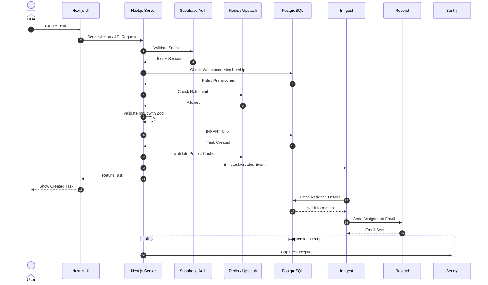
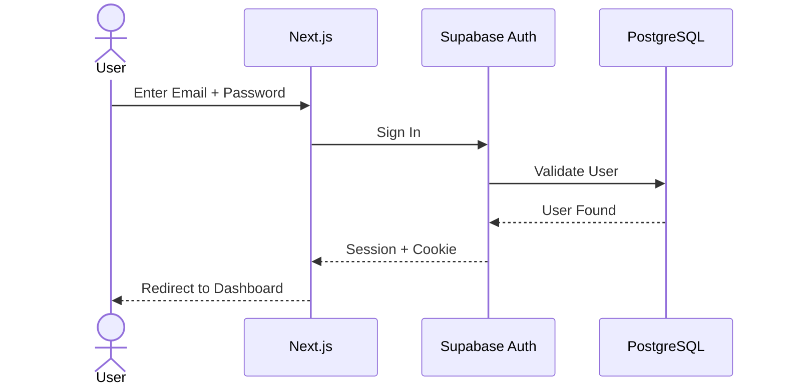
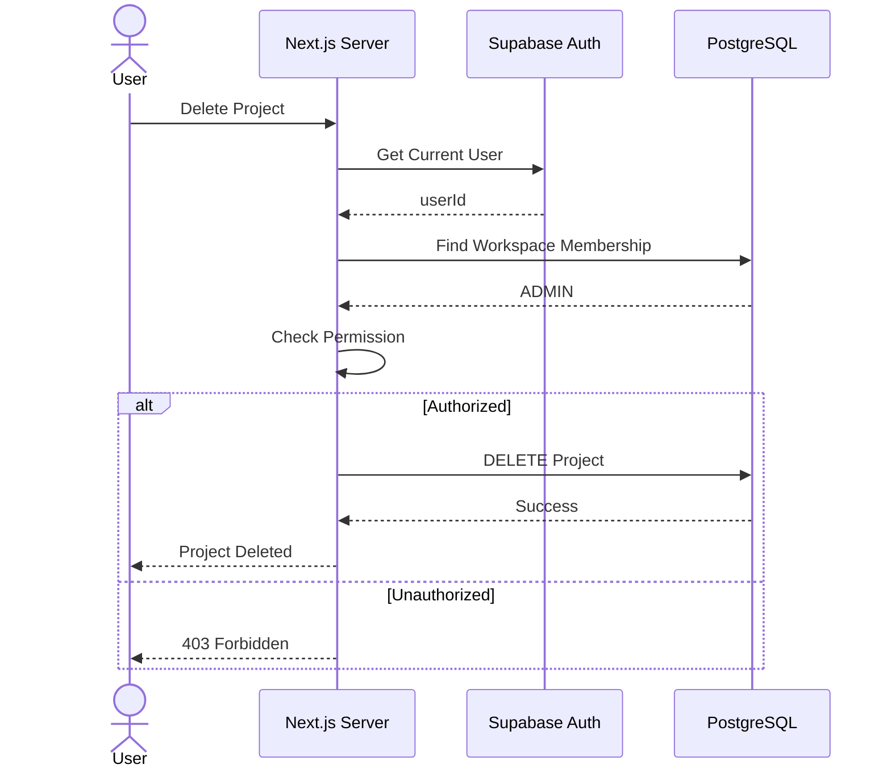
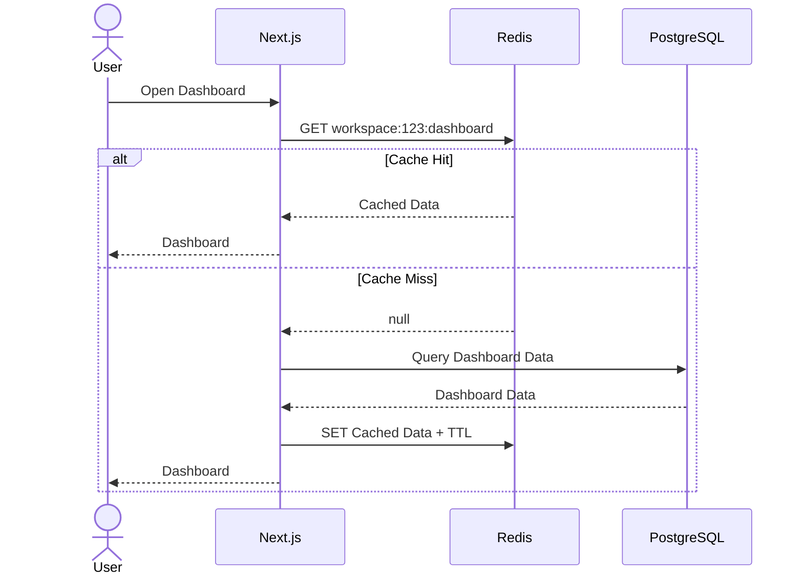
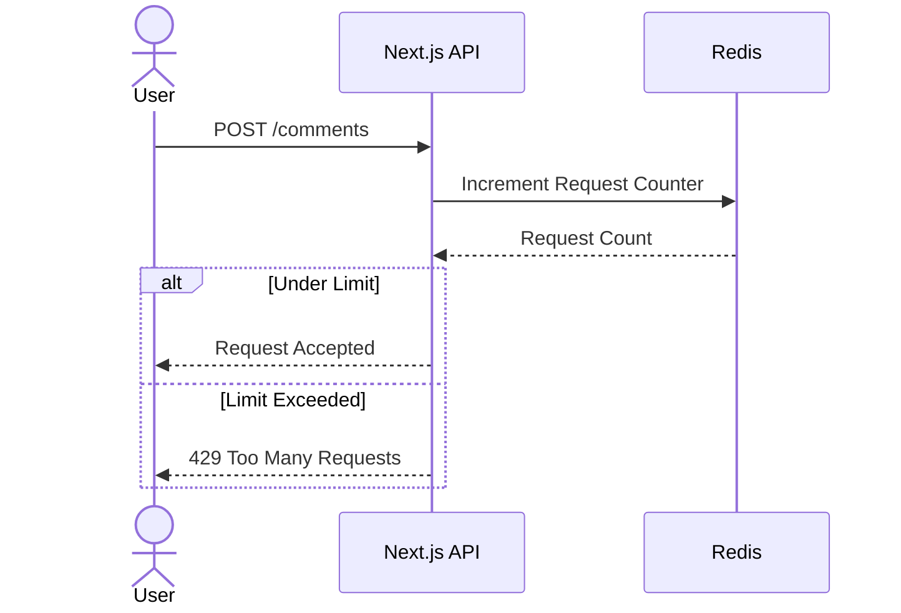
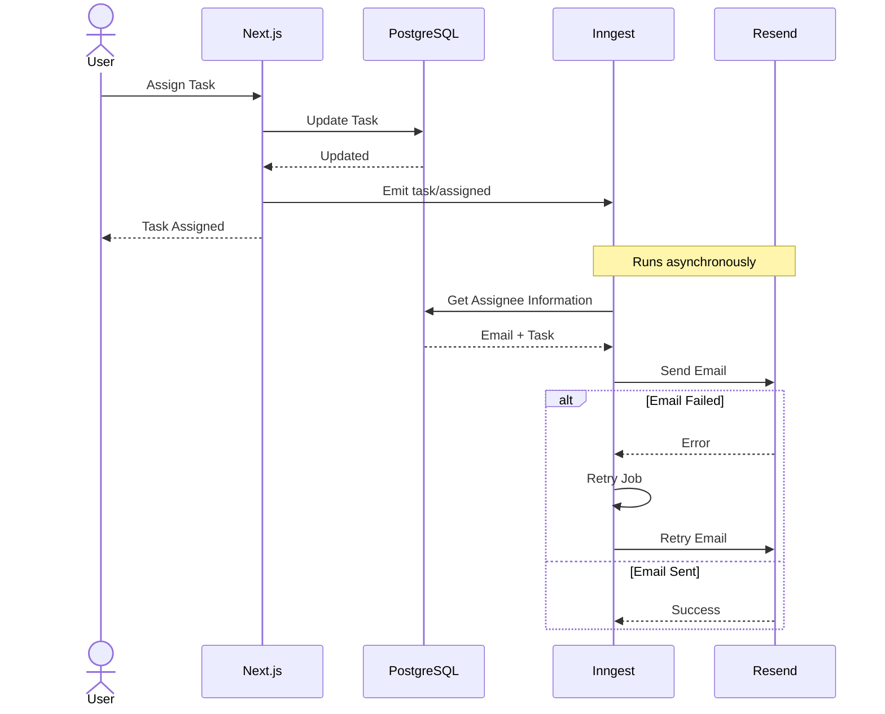
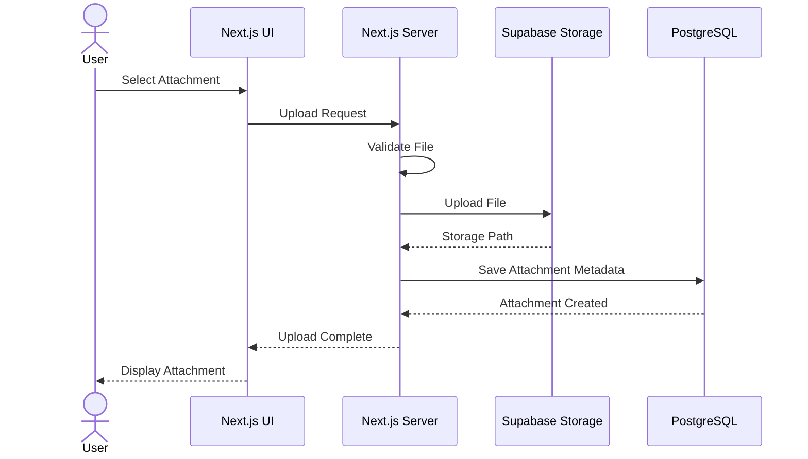

# TaskFlow 

A production-oriented **full-stack project management SaaS** built to learn modern full-stack development concepts including authentication, authorization, database design, caching, background jobs, emails, file storage, rate limiting, monitoring, and deployment.

Think of it as a simplified **Linear / Jira / Trello**.

---

##  Features

*  Email + Google authentication
*  Create and manage workspaces
*  Invite workspace members
*  Role-based access control (Owner / Admin / Member)
*  Create and manage projects
*  Task management
*  Assign tasks to members
*  Task status and priority
*  Task comments
*  File attachments
*  Search, filtering and pagination
*  Workspace dashboard
*  Activity logs
*  Redis caching
*  API rate limiting
*  Email notifications
*  Deadline reminders
*  Background jobs
*  Error monitoring
*  Production deployment

---

#  Tech Stack

| Layer           | Technology               |
| --------------- | ------------------------ |
| Framework       | Next.js + TypeScript     |
| UI              | Tailwind CSS + shadcn/ui |
| Database        | Supabase PostgreSQL      |
| ORM             | Drizzle ORM              |
| Authentication  | Supabase Auth            |
| Validation      | Zod                      |
| Cache           | Redis / Upstash          |
| Rate Limiting   | Upstash Redis            |
| Background Jobs | Inngest                  |
| Email           | Resend                   |
| Storage         | Supabase Storage         |
| Monitoring      | Sentry                   |
| Deployment      | Vercel                   |

---

#  Architecture

```text
                         User
                           │
                           ▼
                    ┌─────────────┐
                    │   Next.js   │
                    │ React / RSC │
                    └──────┬──────┘
                           │
                Server Actions / APIs
                           │
          ┌────────────────┼────────────────┐
          │                │                │
          ▼                ▼                ▼
    Supabase Auth     PostgreSQL          Redis
                           │
                      Drizzle ORM
                           │
                 ┌─────────┴─────────┐
                 ▼                   ▼
              Inngest              Resend
          Background Jobs           Email
```

---

#  Complete Sequence Diagram

The following represents the lifecycle of a typical authenticated task creation request.



This teaches one of the most important full-stack concepts:

```text
Request Path
──────────────────────────────

User
 ↓
Frontend
 ↓
Server
 ↓
Authentication
 ↓
Authorization
 ↓
Rate Limiting
 ↓
Validation
 ↓
Database
 ↓
Cache Invalidation
 ↓
Background Event
 ↓
Response


Async Path
──────────────────────────────

Inngest
 ↓
Database
 ↓
Resend
 ↓
Email
```

---

#  Authentication Sequence



Authentication determines:

> **Who is the user?**

Authorization determines:

> **What can the user do?**

---

#  Authorization Sequence



Workspace roles:

| Action           | Owner | Admin | Member |
| ---------------- | ----: | ----: | -----: |
| View workspace   |     ✅ |     ✅ |      ✅ |
| Create project   |     ✅ |     ✅ |      ❌ |
| Create task      |     ✅ |     ✅ |      ✅ |
| Invite members   |     ✅ |     ✅ |      ❌ |
| Remove members   |     ✅ |     ✅ |      ❌ |
| Delete workspace |     ✅ |     ❌ |      ❌ |

Authorization must always be enforced on the **server**.

---

#  Redis Cache Sequence



Concepts learned:

```text
Cache Hit
Cache Miss
TTL
Cache Invalidation
Cache Keys
Performance Optimization
```

---

#  Rate Limiting Sequence



Example policy:

```text
POST /comments

20 requests
per user
per minute
```

---

#  Background Job Sequence

Email delivery should not unnecessarily increase request latency.



This introduces:

```text
Event-driven architecture
Background processing
Retries
Failure handling
Idempotency
Async workflows
```

---

# File Upload Sequence



The actual file goes to **object storage** while PostgreSQL stores metadata such as:

```text
id
task_id
file_name
storage_path
file_size
mime_type
uploaded_by
created_at
```

---

#  Database Design

Main tables:

```text
users
workspaces
workspace_members
projects
tasks
comments
attachments
invitations
activity_logs
```

Relationships:

```text
User
 │
 └── WorkspaceMember
          │
          ▼
      Workspace
          │
          ├── Projects
          │     │
          │     └── Tasks
          │           ├── Comments
          │           └── Attachments
          │
          ├── Invitations
          │
          └── ActivityLogs
```

---

#  Project Structure

```text
taskflow/
│
├── app/
│   ├── (auth)/
│   │   ├── login/
│   │   ├── signup/
│   │   └── forgot-password/
│   │
│   ├── dashboard/
│   │
│   ├── workspace/
│   │   └── [workspaceId]/
│   │       ├── projects/
│   │       ├── members/
│   │       └── settings/
│   │
│   └── api/
│       ├── inngest/
│       ├── upload/
│       └── health/
│
├── components/
├── actions/
│
├── db/
│   ├── index.ts
│   ├── schema/
│   └── migrations/
│
├── lib/
│   ├── supabase/
│   ├── redis.ts
│   ├── resend.ts
│   ├── auth.ts
│   ├── permissions.ts
│   └── rate-limit.ts
│
├── inngest/
│   ├── functions/
│   └── client.ts
│
├── emails/
├── validators/
├── types/
│
├── drizzle.config.ts
├── .env.local
├── package.json
└── README.md
```

---

#  Development Roadmap

```text
Phase 1
Next.js + TypeScript + Tailwind + shadcn
                ↓
Phase 2
Supabase PostgreSQL + Drizzle
                ↓
Phase 3
Supabase Authentication
                ↓
Phase 4
Workspace / Project / Task CRUD
                ↓
Phase 5
RBAC + Authorization
                ↓
Phase 6
Redis Cache + Rate Limiting
                ↓
Phase 7
Resend Emails
                ↓
Phase 8
Inngest Background Jobs
                ↓
Phase 9
Supabase Storage
                ↓
Phase 10
Sentry + Security + Optimization
                ↓
             Vercel
```

---

#  Full Application Lifecycle

By the end of the project, you should understand this complete flow:

```text
                    USER
                      │
                      ▼
                  React UI
                      │
                      ▼
                  Next.js
                      │
            ┌─────────┴─────────┐
            ▼                   ▼
      Authentication        Rate Limit
            │                   │
            └─────────┬─────────┘
                      ▼
                Authorization
                      │
                      ▼
                  Validation
                      │
                      ▼
                Business Logic
                      │
            ┌─────────┴─────────┐
            ▼                   ▼
        PostgreSQL             Redis
            │                   │
            └─────────┬─────────┘
                      ▼
                 Emit Event
                      │
                      ▼
                   Inngest
                      │
              ┌───────┴───────┐
              ▼               ▼
           Resend          Scheduled
           Email             Jobs

                 + Sentry
              Observability
```

The goal is not just to know **Next.js**.

The goal is to understand what happens from the moment a user clicks a button until the request travels through **frontend → server → authentication → authorization → cache → database → background infrastructure → external services → production monitoring**.
